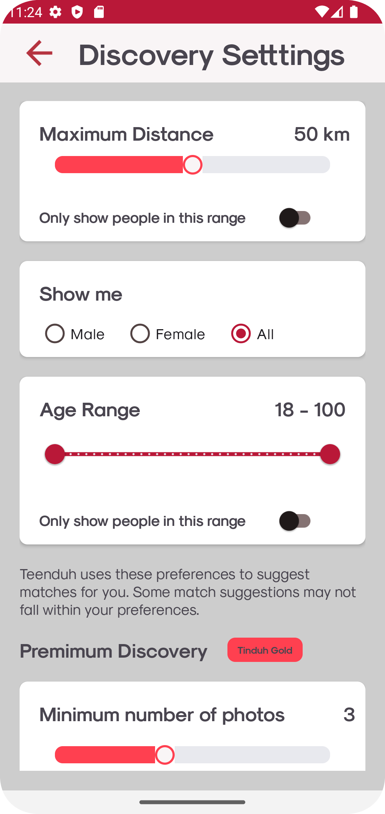

# TinDuh
A bold attempt for Tinder clone

## Features
### For User
- Authentication with Google, phone number and Facebook.
- Diversify your profile with personalities, hobbies, sexual preferences, 
- Find your other half with Elo-Matching Algorithm!

  **Unsatisfied?** A setting dashboard is available to fine-tune your match!
- **Feeling abused?** File a report for a ban real quick.
- **Cannot be patient for 2 weeks?** Access to premium interaction as SUPER LIKE.

### Administration
- Inspect app statistics: Retention rate, User distribution, etc.
- Handle user database.
+ Handing report ticket (and ban users).

## Technologies
- Firebase for storage, authentication.
- Okhttp3, Stripe, Nodejs for payment system
- Some UI libraries for card animation.

## Misc
- A [Nodejs server](https://github.com/OnlyUsePascal/TeenDuh-Stripe) should be run to test the payment feature.

## Showcase
 

<!--  -->

## Contributors

